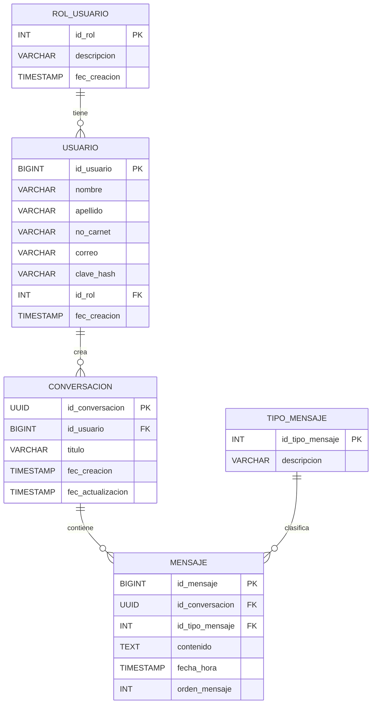

# StudyBot

Proyecto con backend en FastAPI y frontend en React para autenticación y chat estudiantil.

## Configuración rápida

### Backend

#### diclaimer para backend con venv

Configuración de entorno virtual en Windows
📦 Crear entorno virtual

Abre una terminal en la carpeta del proyecto y ejecuta:

python -m venv venv

Esto creará una carpeta llamada venv con el entorno virtual.

⚡ Activar entorno virtual
En CMD:
venv\Scripts\activate
En PowerShell:
venv\Scripts\Activate.ps1
⚠️ Problema común en PowerShell (Execution Policy)

Si aparece un error de permisos al activar el entorno, ejecuta:

Set-ExecutionPolicy -ExecutionPolicy RemoteSigned -Scope CurrentUser

Luego intenta activar nuevamente:

venv\Scripts\Activate.ps1
✅ Verificar que está activo

Si todo salió bien, verás algo como esto en tu terminal:

(venv) C:\ruta\de\tu\proyecto>
❌ Desactivar entorno virtual

Para salir del entorno virtual:

deactivate


1. Edita `src/api-ia/.env` con los datos reales de tu instancia MySQL en AWS.
2. Instala dependencias con `python -m pip install -r src/api-ia/requirements.txt`.
3. Asegúrate de haber ejecutado el script SQL de creación de `studybot_db` en tu base de datos.
4. Inicia el backend desde `src/api-ia` con `uvicorn main:app --reload`.
5. Dale  `uvicorn main:app --reload --host 0.0.0.0 --port 8000  `

Variables importantes del backend:

- `DATABASE_URL`: URL completa de conexión si prefieres una sola variable.
- `DB_HOST`, `DB_PORT`, `DB_NAME`, `DB_USER`, `DB_PASSWORD`: alternativa para armar la conexión.
- `DB_SSL_ENABLED`, `DB_SSL_CA`: opciones para conexión TLS a AWS/RDS.
- `JWT_SECRET`: firma de tokens.
- `CORS_ORIGINS`: orígenes permitidos para el frontend.

### Frontend

1. Edita `src-ui/Frontend/.env` con la URL del backend.
2. Instala dependencias con `npm install`.
3. Inicia Vite con `npm run dev`.

## Persistencia

El backend ya no usa los archivos CSV para autenticación ni conversaciones. Ahora guarda:

- Usuarios en la tabla `usuario`
- Conversaciones en la tabla `conversacion`
- Mensajes en la tabla `mensaje`

Durante el arranque, el backend también verifica que existan:

- Roles `admin` y `student`
- Tipos de mensaje `user`, `assistant` y `system`
- Un usuario administrador por defecto usando las variables `AUTH_DEFAULT_ADMIN_*`

## Diagrama



## .env

```
    CORS_ORIGINS=http://localhost:5173,http://127.0.0.1:5173,http://localhost:5174
    JWT_SECRET=
    JWT_LIFETIME_DAYS=1
    DATABASE_URL=
    DB_HOST=
    DB_PORT=
    DB_NAME=
    DB_USER=
    DB_PASSWORD=
    DB_SSL_ENABLED=false
    DB_SSL_CA=
    DB_ECHO=false
    OPENAI_API_KEY=''
    OPENAI_MODEL_ID=''
    API_KEY=''
    APP_ENV=development
    PORT=8000
    AUTH_DEFAULT_ADMIN_EMAIL=
    AUTH_DEFAULT_ADMIN_PASSWORD=
    AUTH_DEFAULT_ADMIN_FIRST_NAME=
    AUTH_DEFAULT_ADMIN_LAST_NAME=
    AUTH_DEFAULT_ADMIN_STUDENT_ID=
```
